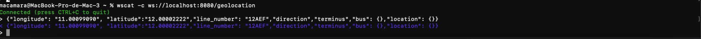
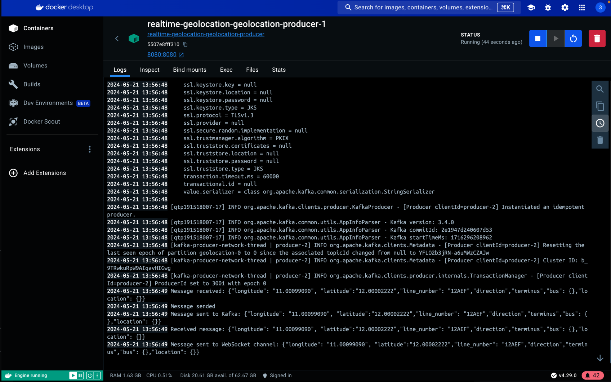

# realtime-bus-locator
Keiken Hackaton Mai 2024 project

# Geolocation Producer-Consumer App

This application consists of a Kafka producer and consumer designed to handle geolocation data. The producer receives geolocation information via web socket and sends it to a Kafka topic. The consumer reads messages from the Kafka topic and sends the message in the channel location to all other registred svc

## Table of Contents

1. [Prerequisites](#prerequisites)
2. [Setup and Installation](#setup-and-installation)

## Prerequisites

- Java Development Kit (JDK) 11
- docker

## Setup and Installation

1. **Clone the repository:**
   ```sh
       git clone https://github.com/yourusername/realtime-geolocation.git
       cd realtime-geolocation

2.  **Run the App and kafka:**
    ```sh
      docker-compose up -d
3.  **Send a request to the Producer to handle it:**
    ```sh
      wscat -c ws://localhost:8080/geolocation -x '{"longitude": "11.00099090", "latitude": "12.00002222", "line_number": "12AEF",          "direction": "terminus", "bus": {}, "location": {}}'

      }'



